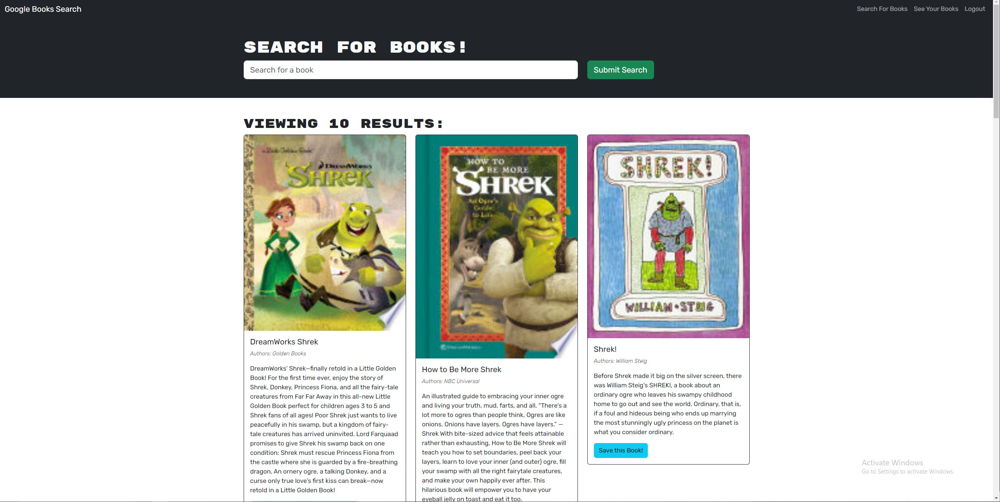

# 21 Book Search Engine

## Screenshot

## Description

This project is designed to demonstrate my ability to refactor code into an apollo/react application with graphql.

## Installation

To install this application, git clone thie repository to your local computer. The user must also install Node.js in order to use this application.

## Usage

This application is deployed to heroku, you can follow the link below to navigate to the site.

## Contribution

This application is homework for Northwest Coding Bootcamp and is complete, there is no need for any contributions.

## Testing

You can test this application  by running the command line prompt "npm start" after installing the required node packages from VS code and using live preview to demo the pwa.